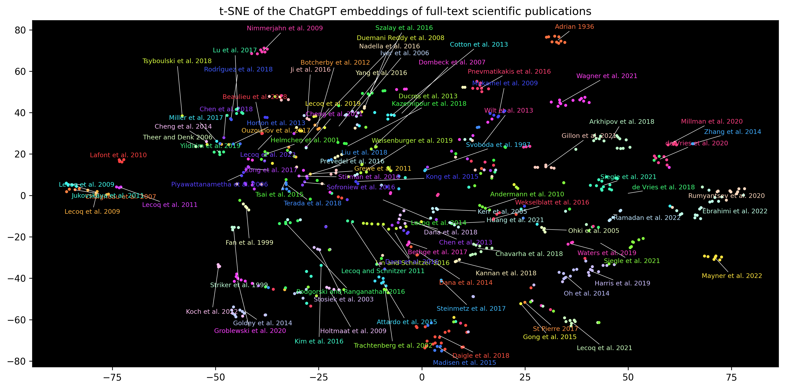
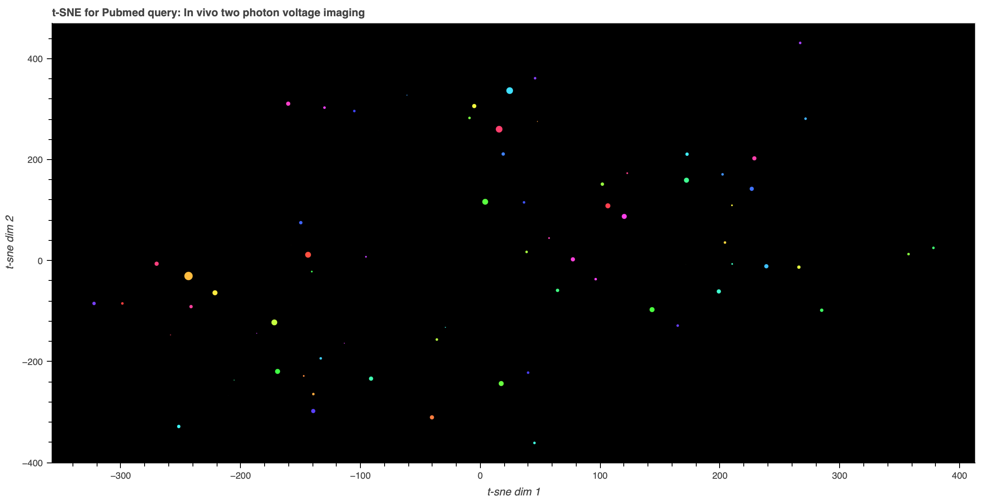
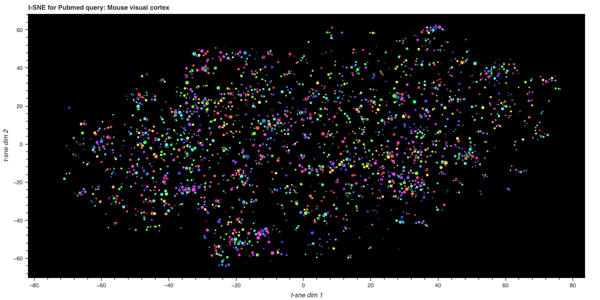

[](LICENSE)


This repository contains basic scripts designed to investigate scientific 
publication PDFs utilizing the ChatGPT API. It has been created to share 
helpful code for navigating the literature. 
**Please note that this code is experimental.** We encourage others to test it, 
and if you find it useful, feel free to share your feedback with us.

Installing
========================

1. You first need to create your conda environment as :

```conda create --name <your_env_name> python=3.10```

2. Then activate it: 

```conda activate <your_env_name>```

3. Install the package 

```pip install .```

4. We rely on the **adjustText** library for positioning labels that currently 
only work from the master branch so install it using: 

```pip install https://github.com/Phlya/adjustText/archive/master.zip```

5. Go the script folder:

```cd scripts```

6. Copy your openAi API key in the .env file. You can find this here: 
https://platform.openai.com/account/api-keys

Running scripts
========================

This package contains a list of classes to facilitate exploring the litterature
using Large Language Models. Currently, we are focusing on OpenAI API but we 
plan to extend in the future. Classes are documented and tested but we 
recommend using our scripts first (in the script/ folder). Those scripts were
designed to be simple to use and facilitate growing a local database of 
publication data.  

1. First, after installing, go the script folder:

```cd scripts```

2. You can use 3 scripts currently. 

* The first one is ran using

```python pdf_summary.py --path_pdf <path_to_your_pdf> --save_summary True```

This will save a little text file along with your pdf with the same filename 
but with a .txt extension. 

* The second one is ran using 

```python list_pdfs_embedding.py --path_folder <path_to_your_pdfs> --database_path <path_to_a_folder>```

The embedding is saved automatically in the folder 
with all your pdfs as ```tsne_embeddings.png```. Currently this plot uses the 
filename of each pdf to assign a label. 

* The third one is ran using 

```python pubmed_embedding.py  --pubmed_query "your query" --field abstract --save_path  <path_to_a_png_file> --database_path <path_to_a_folder>```

Althought database_path is optional, we highly recommend choosing a folder on 
your local hard drive to store your paper database. This will limit calls to 
the Large Language Models and save you time. 
Papers embedding could scale to thousands of papers eventually if you process 
your entire litterature. 

Parameters for pdf_summary
========================

* **--path_pdf**: Path to a PDF file that you want to summarize.

Type: string

Default: os.path.join(script_path, '../example/2020.12.15.422967v4.full.pdf')

* **--save_summary**: Save the generated summary in a txt file alongside the PDF 
file.

Type: boolean

Default: True

* **--save_raw_text**: Save the raw text in a txt file along the pdf file.

Type: boolean

Default: True

* **--cut_bibliography**: Try not to summarize the bibliography at the end of the 
PDF file.

Type: boolean

Default: True

* **--chunk_length**: Determines the final length of the summary by summarizing 
the document in chunks. More chunks result in a longer summary but may lead 
to inconsistency across sections. Typically, 1 is a good value for an abstract, 
and 2 or 3 for more detailed summaries.

Type: integer

Default: 1

* --**database_path**: Path to the database file. This is an optional argument. 
If path is not provided, no database will be used or created. If the path is 
provided, the database will be created if it does not exist. If it exists, 
it will be loaded and used. Use this to grow your database of papers.

Type: str

Default: None

Parameters for pubmed_embedding
========================

* --**pubmed_query**: A query made to pubmed. This can return a very large number of 
publications and they will be processed in chunks. 

Type: str

Default: None

* --**field**: You can embed the title or the abstract currently. Just give 'title'
or 'abstract'. Your choice here will depends on how much details you want your embedding 
to rely on. 

Type: str

Default: abstract

* --**database_path**: Path to the database file. This is an optional argument. 
If path is not provided, no database will be used or created. If the path is 
provided, the database will be created if it does not exist. If it exists, 
it will be loaded and used. Use this to grow your database of papers.

Type: str

Default: None

* --**save_path**: Path to a local image file. This is where the plot will be saved. 

Type: str

Default: None

* --**perplexity**: Perplexity for the t-SNE plot, default is 8. 
Higher values will make the plot more spread out. 
Lower values will make the plot more clustered.

Type: int

Default: 8

* --**max_results**: Maximum number of results to fetch from pubmed

Type: int

Default: 100

Examples
========================

* **paper_summary**

See the example/ folder for example runs. 
There is a typical short example (length of a typical abstract) and a long 
summary (using chunk_length 4). 

* **list_pdfs_embedding**

Here is an example embedding for approximately 100 publications, mostly 
around in vivo calcium imaging of neuronal activity.



* **pubmed_embedding**

Here is an example embedding for the following command:
```python pubmed_embedding.py --pubmed_query "In vivo two photon voltage imaging" --field abstract --save_path ../example/twophotonvoltage.html --perplexity 5```

Below is a screenshot. [The generated plot is interactive](example/twophotonvoltage.html) 
to explore the content of each paper. 


Here is an second embedding for the following command for a very large number of paper:
```python pubmed_embedding.py --pubmed_query "Mouse visual cortex" --field abstract --save_path ../example/mouse_invivo_recordings.html --max_result 3500 --perplexity 30```

Below is a screenshot. [The generated plot is interactive](example/mouse_invivo_recordings.html) 
to explore the content of each paper. 


Database
========================
The papers_extractor utilizes a straightforward database created with the 
DiskCache Python package. By specifying the database_path, the module will 
handle everything for you. Its purpose is to compile a collection of papers, 
complete with statistics and numerical embeddings. Additionally, it 
automatically regulates the number of calls made to LLM APIs, effectively 
reducing costs.  Any previously processed pdf is 
automatically cached. To determine if a pdf was previously processed, it uses
a hash from the content of the pdf, so you can freely rename them.

You can store your database (or several) at any location on your local 
drive using the **database_path** parameter. 

How to contribute?
========================

1. First go to tests/ and read the README.md 

2. Make a PR against main. This will run CI through github actions. 

Credits
========================
This repository was started by Jerome Lecoq on April 12th 2023. 
Please reach out jeromel@alleninstitute.org for any questions. 
If this is useful to you, :wave: are welcome!
